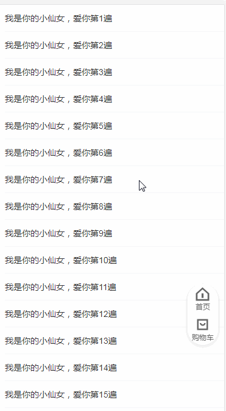

## vant-shop-demo

商城常用的组件开发基于 vant ui 开发，让商城开发变得更简单

以我整理的 vue 项目脚手架[vue-h5-template](https://github.com/sunnie1992/vue-h5-template)为基础

开发商城组件库，高度组件化
[项目介绍](https://segmentfault.com/a/1190000020113557)

在这里你可以找到

1.  可拖拽悬浮按钮
2.  横向滚动导航栏
3.  。。。

## 线上体验


## 可拖拽悬浮按钮

vue 开发手机端悬浮按钮实现，可以拖拽，滚动的时候收到里边，不影响视线



## 参数

| 字段名  | 类型   | 默认值        | 描述                                                                     |
| ------- | ------ | ------------- | ------------------------------------------------------------------------ |
| padding | String | '10 10 10 10' | 悬浮按钮可拖拽的安全范围，与 css padding 传参一致                        |
| scoller | String | ''            | 监听页面滚动容器 id,不传时候监听 window （解决滚动时悬浮框按钮不收进去） |

## 注意

如果滚滚动的时候收到里边，需要穿 scoller 参数
比如：
你的滚动列表外层 div 设置 id

```html
<div id="loadmore">
  <van-list v-model="loading" :finished="finished" finished-text="没有更多了" @load="onLoad">
    <van-cell v-for="item in list" :key="item" :title="`我是你的小仙女，爱你第${item}遍`" />
  </van-list>
</div>
```

组件传参 scoller="loadmore"

```html
<float-icons **scoller="loadmore" ** padding="10 10 60 10" class="icons-warp"></float-icons>
```

因为你可能使用组件导致监听的滚动元素是 window，所以你需要将你的滚动容器的 id 传进我的组件

## 横向滚动导航栏

基于 better-scroll 开发，横向滚动导航栏

##使用
将组件复制到你的组件目录下，传导航数组 list
点击切换 navbar 的时候触发 change 方法，

## 参数

| 字段名 | 类型  | 默认值 | 描述     |
| ------ | ----- | ------ | -------- |
| list   | Array | []     | 导航数组 |

## 事件

| 事件名 | 说明       | 回调参数                                    |
| ------ | ---------- | ------------------------------------------- |
| change | 切换导航项 | {index: 该点击项的索引值,item:该点击项数据} |

## 问题反馈

有什么问题可以提 issue 或扫描微信二维码跟我联系，项目持续优化，加群获取最新更新消息

[提 issue](https://github.com/sunnie1992/vant-shop-demo/issues/new)

## 关于我

您可以扫描添加下方的微信并备注 Sol 加交流群，给我提意见，交流学习。

<p>
  
</p>
 
如果对你有帮助送我一颗小星星（づ￣3￣）づ╭❤～
